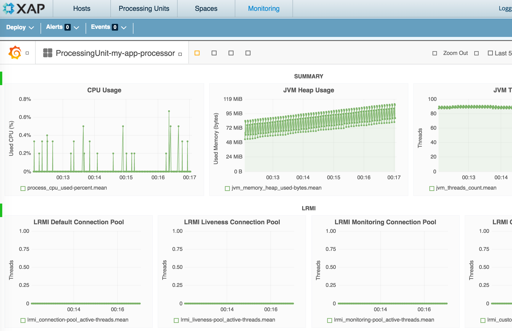

### Driver scripts

This directory contains scripts that are found on Driver AMIs in the FE/PS Sandbox account on EC2. 

This README is partial, as of this commit.

There is some overlap with those scripts stored in the **ami/driver** directory. This, and the incompleteness of this README will be addressed as part of [PST-40](http://10.8.1.184:8080/issue/PST-40).  

### InfluxDB / Grafana installation 

##### Considerations before you start

To start with, you can run the InfluxDB and Grafana processes from the same VM. Or you can start two copies of the InfluxDB/Grafana AMI and split responsibilities. This might be advisable for large grids where the amount of data being sent to InfluxDB would require a large disk partition to accommodate it. We are not likely to encounter this any time soon, but it is possible for Performance Testing activities that it might come up in the future. Also: Be aware that Grafana itself can be backed up to PgSQL, H2, or MySQL databases. At present it is using the default (H2). 

It is not necessarily clear whether one should perform the recipe for installation before or after starting an XAP grid. This is because the configurations have a circular dependency in them when the VM creation lifecycle is defined as **start VM, run XAP or metrics components.** This is because IPs and hostnames cannot usually be known ahead of VM startup in cloud environments.
 
Therefore, if you were to start the XAP node(s) first, you would not know the hostnames of the Grafana and InfluxDBs to point them at in `metrics.xml` (they haven't been created yet).
  
On the other hand, if you were to create the InfluxDB+Grafana nodes first, you would have to update the metrics.xml files on all XAP/MGT nodes **before XAP startup** but **after VM creation**.

There are nuanced (i.e. complicated) ways of working around this, but it's easy enough to just restart the XAP grid after pushing the metrics.xml files. 

##### Software install recipe

1. `rm /tmp/grafana.ini /tmp/metrics.xml`
 
 This is a safety measure for preventing unexpected - but not necessarily buggy - results in config.
 
 
1. `./create-metrics-xml.sh --help`
 
 Follow instructions.
 
 
1. `./create-grafana-ini.sh --help`
 
 Follow instructions.
 
 
1. (optional): check the contents of `/tmp/grafana.ini` and `/tmp/metrics.xml` to make sure they match your expectations.
 
 
 
1. `./push-metrics-xml.sh --help`
 
 Follow instructions.
 
 
1. `./push-grafana-ini.sh --help`
 
 Follow instructions.
 
 

##### More (manual) configuration recipe

1. Navigate to http://<grafana-host>:3000/ then click on Datasources -> Add Datasource
 
 
 

 
 
 
1. Start XAP
1. Start WEB UI
 
 
Browse to http://<mgt-ui-host>:8099/ and login (with empty username and empty password).
Check the logs on <mgt-ui-host> (usually, they're at /opt/gigaspaces/current/logs/start-webui.log). 
There **should be** a mention that a Graphana datasource is already defined.
 
 
1. Deploy any XAP application
+ `some-directory% mvn os:create -Dtemplate=basic`
+ WEB-UI -> Processing Units -> Deploy Button -> file chooser to `some-directory/target/my-app-processor.jar`
++ Use dialogs -> ... -> Deploy
++ Click on Monitoring TAB 
Congrats! It took only that much work to get montitoring working:
 
 
 

 
 